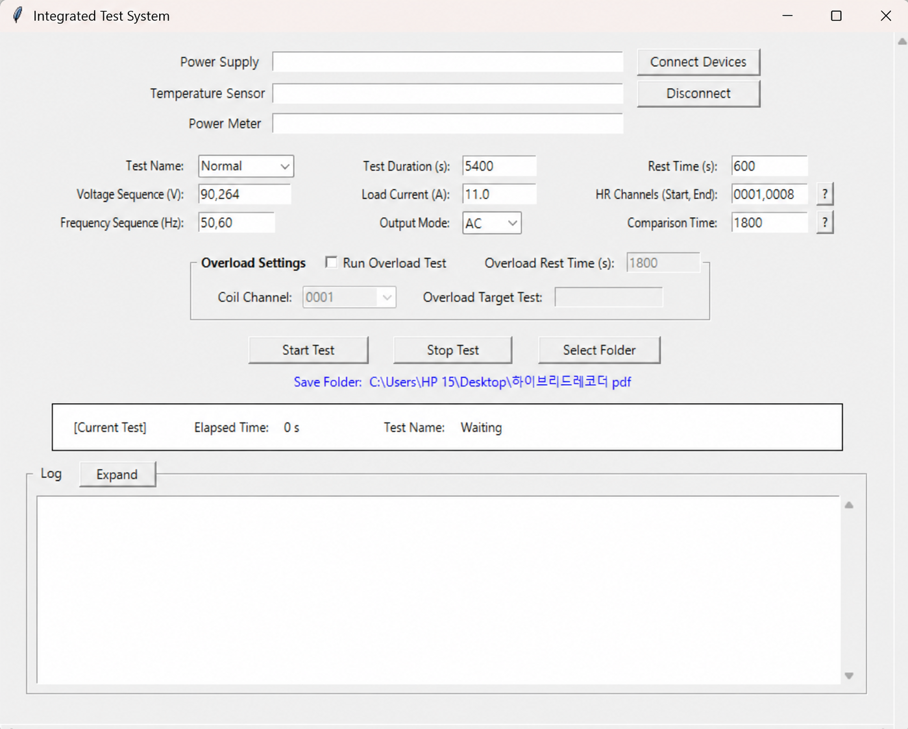
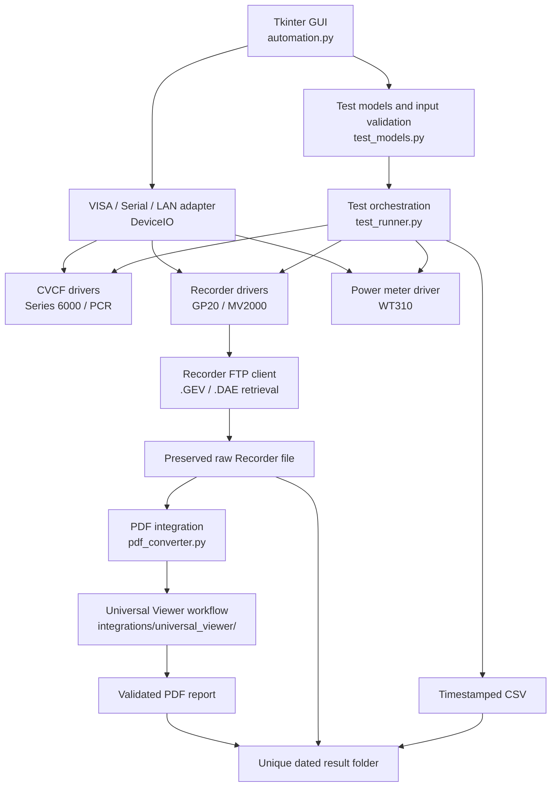

# Equipment Automation

**Language:** English | [Korean](README_KR.md)

## Overview

The project required troubleshooting across laboratory instruments, communication interfaces, FTP workflows, and Windows desktop applications.
Equipment Automation is a Windows-based Python application that coordinates laboratory heating tests and turns a multi-step equipment workflow into a repeatable test plan. From a Tkinter interface, an engineer can select AC or DC conditions, configure Recorder channels and sampling intervals, connect optional power equipment, and run sequential tests while measurements are written to CSV.

The application integrates laboratory instruments over VISA, serial, and LAN/socket connections. It controls a required Yokogawa Recorder, optionally configures a CVCF power supply and reads a WT310 power meter, retrieves the Recorder's native `.DAE` or `.GEV` file over FTP, and drives Yokogawa Universal Viewer plus Microsoft Print to PDF to produce a report.

The original implementation concentrated the GUI, communication transports, instrument commands, measurement logic, stabilization checks, and CSV output in `automation.py`. The current repository retains that GUI entry point while moving test models, orchestration, model-specific drivers, FTP transfer, result-folder management, and Universal Viewer automation into focused modules.

## Demo

<p align="center">
  
</p>
<p align="center"><sub>Main interface for device connections, test conditions, channels, and result paths</sub></p>

### Device connection and test execution

<p align="center">
  
</p>

The application connects the configured instruments, starts the selected condition, and records live measurements without blocking the GUI.

### Recorder retrieval and PDF generation

<p align="center">
  
</p>

After a test completes, the application retrieves the Recorder file and controls Universal Viewer to generate and retain the PDF report.

**Direct operator time** means time spent actively configuring the test, operating equipment, starting or stopping activities, monitoring or intervening, handling Recorder files, configuring Universal Viewer, generating the PDF, and organizing results. It excludes unattended equipment operating or waiting time. Any future results should label measured data, recorded data, and engineer-reported estimates separately.

## Problem / Before Automation

### Software architecture

The documented original application placed UI state, connection handling, device-specific commands, measurement loops, stabilization logic, and CSV output in one module. This structure increased the scope of changes needed for model-specific behavior, required the GUI to understand instrument behavior, and made configurations without every instrument difficult to represent.

Supporting equipment with different command sets also required more than changing an address. For example, the GP20 and MV2000 use different connection handshakes, recording commands, channel ranges, response formats, and native file extensions. A shared workflow needed explicit boundaries around those differences.

### Engineering workflow

The documented pre-automation workflow combined software and manual desktop work: configure equipment, start and monitor recording, collect measurements, stop the test, move the Recorder result, open it in Universal Viewer, configure the graph and time display, position A/B cursors, print to PDF, and organize the artifacts. When Recorder FTP access succeeds, the current code replaces the documented normal USB/manual transfer step with automated file detection and retrieval, then continues through the Viewer and PDF workflow.

## Solution / After Automation

The current system converts GUI input into explicit `TestPlan` and `TestCondition` objects and passes them to one `TestRunner`. The runner coordinates optional CVCF configuration, Recorder control, power and temperature sampling, CSV flushing, stabilization checks, condition cooldowns, and downstream result processing without embedding model-specific commands in the orchestration layer.

Factories select focused drivers for supported instruments. A common transport adapter handles VISA, serial, and LAN I/O, while the transport and Recorder abstractions jointly handle model-appropriate line endings and multiline termination; individual drivers contain their commands, parsing rules, and channel behavior. After a condition, the Recorder integration compares FTP listings, polls for the new native result, downloads it through a temporary `.part` file, and renames it to the final result path after a non-empty transfer completes.

The PDF pipeline validates the raw file, creates and verifies a working copy, discovers and normalizes Universal Viewer, configures its display, adjusts the A/B cursor interval, automates Microsoft Print to PDF, and validates the output. Failures are logged at the Recorder stop, CVCF shutdown, FTP, Viewer/PDF, and overall test stages so artifacts already completed before many downstream failures can remain available.

## Before vs. After

| Category | Before | Current system |
|---|---|---|
| Code architecture | GUI, device, measurement, stabilization, and CSV logic concentrated in one module | Models, orchestration, drivers, FTP, result management, and Viewer integration are separated |
| Device configuration | Initial workflow assumed Series 6000, GP20, and WT310 | Recorder is required; CVCF and power meter are optional |
| Supported models | Series 6000, GP20, WT310 | Adds PCR-series CVCF and MV2000 while retaining the initial models |
| Test execution | Conditions and stabilization were handled in GUI code | Validated test plans are executed by a shared runner |
| Recorder results | Documented manual/USB movement after recording | New `.DAE` or `.GEV` files are detected and retrieved over FTP |
| PDF reporting | Manual Universal Viewer workflow | Viewer configuration, cursor adjustment, printing, and validation are orchestrated |
| Operator involvement | [BEFORE_MIN] min | [AFTER_MIN] min |

## Workflow Transformation

### Before automation

Equipment configuration<br>
→ recording and measurement monitoring<br>
→ Recorder file handling and transfer<br>
→ Universal Viewer graph/time setup<br>
→ A/B cursor setup<br>
→ Print to PDF<br>
→ manual result organization

### Current system

Configure and connect devices in the GUI<br>
→ run a background test plan<br>
→ collect and flush timestamped measurements<br>
→ evaluate temperature stabilization<br>
→ stop equipment and retrieve the new Recorder file over FTP<br>
→ prepare and configure Universal Viewer<br>
→ generate and validate a PDF<br>
→ retain artifacts in a unique test-result folder

## System Architecture



## Engineering Highlights

### Modular architecture

The refactor separates data representation, execution policy, instrument behavior, transport details, post-processing, and UI concerns. Drivers depend on a transport and log callback rather than the Tkinter application. As a result, the runner calls stable operations such as `configure`, `recording_start`, and `read_current` instead of branching on equipment models.

For models compatible with an existing equipment category and workflow, model-specific logic can usually be added through the relevant driver contract and factory mapping. Keeping `TestPlan` construction separate also makes AC/DC conditions and optional devices explicit before a long-running test starts.

### Device abstraction and integration

- `DeviceIO` normalizes line-oriented VISA, serial, and LAN communication. Serial connections try 9600, 19200, and 38400 baud; LAN sockets apply timeouts and support multiline responses terminated by `EN`.
- The Series 6000 and PCR drivers keep their different output/configuration command sequences separate. The PCR implementation uses SCPI-style commands, distinguishes AC voltage from DC offset commands, selects a voltage range, and checks the instrument error queue.
- The WT310 driver configures a fixed ASCII numeric layout for voltage, current, active power, and voltage frequency. An individual query failure is logged and recorded as an empty value instead of automatically terminating a long test.
- Recorder drivers encapsulate their distinct login handshakes, start/stop commands, temperature response parsing, channel validation, and CRLF/multiline behavior.
- Factories use Recorder ports or instrument identity responses to select a known implementation. Unknown power meters fail explicitly rather than receiving speculative commands.

### Test orchestration

For each condition, `TestRunner` can configure and enable the CVCF, snapshot the Recorder's FTP listing, start recording, sample temperatures and power, flush each row to CSV, evaluate stabilization, and publish progress. Cleanup attempts to stop recording and disable CVCF output even when the condition exits through an exception or user stop.

Multiple voltage/frequency conditions run sequentially with a configurable rest period. The optional overload workflow tracks the highest temperature observed on the configured Coil channel across all normal conditions. After the configured overload rest time, it automatically selects and reruns the condition in which that peak occurred. The overload rerun is not stopped by the normal test-duration setting and continues until the operator requests a stop.

### Reliability and failure isolation

The workflow has observable stage boundaries:

```text
Test execution → CSV logging → Recorder FTP retrieval → Viewer/PDF processing → result retention
```

- CSV rows are flushed after each sample, and the file is closed from normal and cleanup paths.
- Recorder and CVCF shutdown failures are caught and logged independently.
- FTP listing and download errors are reported separately from PDF conversion errors.
- A PDF failure does not invalidate a successful Recorder download; tests explicitly verify this behavior.
- Viewer, display, and cursor prerequisite failures stop the workflow before printing. After printing, the workflow verifies that a non-empty PDF was created and optionally validates its structure with `pypdf`.
- Automatic test artifacts are kept together in a newly created date-named folder such as `YYYY-MM-DD(2)`, avoiding reuse of an existing test directory.

The top-level runner catches and logs execution exceptions rather than propagating them to the Tkinter event loop. This supports artifact preservation and operator diagnosis, but it is not a transactional recovery system; a forced process termination can still leave hardware or downstream work incomplete.

### Data integrity

Downloaded Recorder data is first written to a `.part` path. Only a non-empty completed transfer is renamed to the final `.DAE` or `.GEV` filename. Existing raw and CSV names receive numeric suffixes rather than being overwritten.

The Universal Viewer pipeline does not open the downloaded source directly. It validates the file and extension, copies it into `output/work/`, and compares both file size and SHA-256 between the source and working copy. PDF paths are also made unique, and generated files must exist and be non-empty; optional `pypdf` validation checks that the PDF can be parsed and has at least one page.

The reusable PDF component can copy a validated PDF to a dated Desktop archive. If a destination with a different size exists, the helper selects a `_copyN` path instead of overwriting it. In the GUI-driven automatic path, that extra copy is deliberately disabled because the PDF is already written beside the raw file in the unique final test folder.

### Background / long-running execution

The Tkinter application starts `TestRunner.run` on a daemon worker thread so measurement and stabilization waits do not block the main event loop. A `threading.Event` provides cooperative stop requests, and UI-facing progress/log callbacks are scheduled back through Tkinter where implemented. This README does not claim general thread safety beyond that current execution design.

## Troubleshooting & System Integration

### Equipment communication

Connection errors are logged with context for missing or unsupported addresses, stale or unconnected configurations, identification failures, serial baud-rate attempts, sockets, and model-specific handshakes. The GUI recognizes VISA/USB resource strings, COM ports, and `host:port` LAN addresses; Recorders currently require LAN.

The integration accounts for behavior that cannot be hidden behind one generic SCPI call. GP20 expects an initial `E0` response and uses `ORec` commands, while MV2000 performs an `E1 402`/admin login exchange and uses `PS0`/`PS1`. Their temperature data and channel formats are normalized before reaching the test runner.

### Recorder / FTP

Before recording, the runner snapshots matching files in `/MEM0/DATA`. After stopping, the FTP client polls for a new file, filters by the model's extension, ranks candidates with FTP modification time and filename timestamps, and tries both filename and absolute remote-path forms for `RETR`. It uses passive FTP, rejects zero-byte downloads, cleans failed partial files, and logs the command and selected remote entry.

These boundaries help isolate whether a failure occurred during Recorder control, FTP login/directory access, file discovery, transfer, or later PDF processing. The code uses anonymous FTP defaults and contains no private device IP addresses or embedded non-empty passwords.

### Universal Viewer / Windows environment

Universal Viewer is a third-party Windows desktop application, so the integration combines `pywinauto`, Win32 APIs, and coordinate-based `pyautogui` actions where semantic controls are insufficient. It:

- discovers the main window by verified title/class rules and excludes helper windows;
- normalizes the window to calibrated geometry before coordinate-sensitive steps;
- applies full time-axis and display-group settings;
- opens and repositions the cursor-value window;
- adjusts the A/B cursor difference to the accepted interval;
- handles Windows print and save dialogs for Microsoft Print to PDF;
- waits for a non-empty output and captures visible-window diagnostics on timeout.

Executable discovery checks an explicit path, `UNIVERSAL_VIEWER_EXE`, common Program Files locations, and the system `PATH`. The checked-in profile records validation against Universal Viewer R3.12.01 with the Win32 backend; another Viewer version, display scaling, window geometry, language, or dialog state can require inspection and recalibration.

### Issue isolation

The Viewer orchestrator wraps opening/copy preparation, window normalization, time-axis setup, display-group configuration, cursor-window access, A/B adjustment, focus, and printing with stage-specific errors. PDF wait failures include the target path and visible-window diagnostics. When a raw file already exists, `run_from_input.py` allows Viewer/PDF problems to be retried without rerunning the equipment test.

### Real-environment validation

The repository contains a Viewer profile labeled for Universal Viewer R3.12.01 and calibration utilities intended for target-PC validation. The Korean documentation instructs maintainers to confirm coordinate changes on the laboratory PC, but the repository does not independently prove that the current revision was validated there. It also does not provide evidence for deployment scale or a quantified reliability rate, so none is claimed here.

## Temperature Stabilization Logic

`StabilizationTracker` maintains timestamped history independently for every required temperature channel. At each check, it requires:

1. the configured minimum elapsed time to have passed;
2. a current numeric sample for every channel;
3. history reaching approximately one configured comparison window into the past; and
4. `|current temperature - temperature near the start of the window| < 1.5°C` for every channel.

The GUI passes the test duration as the first stabilization-check time, uses a default 600-second recheck interval in the generated plan, and lets the comparison window be configured (the documented/default use is approximately 30 minutes). When the threshold is not met, CSV recording continues and the test is re-evaluated later.

The current comparison examines two points:

| Current approach | Potential improvement |
|---|---|
| `|current - approximately 30 minutes earlier|` | `max temperature - min temperature` across the full comparison window |

Evaluating the full range is a reasonable future enhancement because it would capture intermediate fluctuations that a two-point comparison can miss. That improvement is not implemented in the current repository.

## Supported Equipment

<table>
  <tr>
    <td align="center"><br><sub>Yokogawa GP20</sub></td>
    <td align="center"><br><sub>Yokogawa MV2000</sub></td>
    <td align="center"><br><sub>Yokogawa WT310E</sub></td>
  </tr>
  <tr>
    <td align="center" colspan="2"><br><sub>APT Series 6000</sub></td>
    <td align="center"><br><sub>Kikusui PCR-6000LE</sub></td>
  </tr>
</table>

### Recorder

- Yokogawa GP20 — LAN control, `.GEV` results, channel blocks ending in 01–10
- Yokogawa MV2000 — LAN control, `.DAE` results, channels 001–048

### CVCF / power supply

- Series 6000
- Kikusui PCR-LE series

### Power meter

- Yokogawa WT310

The Recorder is required. CVCF and power-meter addresses may be left blank for Recorder-centered configurations.

## Automated Test Workflow

1. Validate the connected Recorder and any configured optional equipment.
2. Create a unique dated result folder.
3. Configure and enable CVCF output when present.
4. Snapshot the Recorder's matching FTP files and start recording.
5. Sample temperatures and optional power values; flush each sample to CSV.
6. Evaluate stabilization and extend/recheck the condition when enabled.
7. Stop Recorder recording and disable CVCF output.
8. Detect and download the new native Recorder file using a partial-file safeguard.
9. Run the Universal Viewer/PDF workflow and validate the output.
10. Wait for the configured cooldown and continue to the next condition.
11. When overload testing is enabled, wait for the configured overload rest time and rerun the condition that produced the selected Coil channel's highest temperature.

### Execution examples

| Test start | Next condition | Stabilization recheck |
|---|---|---|
|  |  |  |

The final result directory keeps the timestamped CSV, native Recorder file, and generated PDF together.

<p align="center">
  
</p>

### Automatic overload condition selection

When overload testing is enabled, the system monitors the configured Coil channel during every normal condition. It remembers the condition associated with the highest measured temperature, displays that automatically selected target in the UI, waits for the configured overload rest time, and runs that condition again as the overload test. The overload run continues until the operator presses **Stop Test**.

| Overload configuration and selected target | Overload execution log |
|---|---|
|  |  |

## Universal Viewer Automation

The pipeline preserves the downloaded source and opens a verified working copy instead. It validates `.DAE`/`.GEV` input, copies it under `output/work/`, compares size and SHA-256, launches the discovered Viewer executable, normalizes the main window, applies full time display and display-group settings, and opens the cursor-value view.

Coordinate profiles and calibration utilities support the graph operations that are not exposed reliably as semantic controls. The cursor routine targets a 1,800-second A/B interval and currently accepts values from 1,795 through 1,805 seconds. It moves the cursor window away from the File menu and initiates Microsoft Print to PDF. The workflow then checks file existence and size and optionally parses the document with `pypdf`.

## Testing

Run the test suite with:

```powershell
python -m unittest discover -s tests -p "test_*.py"
```

The checked-in tests cover:

- raw-file validation, working-copy preservation, size checks, and filename collisions; SHA-256 verification is implemented in the working-copy path exercised by these tests;
- result-folder and non-overwriting output behavior;
- Viewer executable/window discovery and helper-window exclusion;
- Viewer launch, UI inspection, display-group, cursor, and print-dialog helpers;
- PDF creation/validation, archive-copy behavior, and end-to-end workflow ordering with test doubles;
- manual raw-file selection and standalone PDF invocation;
- Recorder-to-PDF integration and preservation of a successful raw download when PDF conversion fails;
- optional overload condition selection and execution.

Most tests isolate Windows and equipment dependencies with fakes or injected helpers. They do not replace validation on the target laboratory PC: Viewer UI behavior remains sensitive to application version, display scaling, window state, localization, and Windows dialog state. The repository does not claim a coverage percentage or broad hardware-in-the-loop test matrix.

## Project Structure

```text
.
├─ automation.py                    # Tkinter UI, connections, and worker startup
├─ test_models.py                   # Test-plan models and input transformations
├─ test_runner.py                   # Test execution, CSV, FTP, and post-processing
├─ pdf_converter.py                 # Automatic Recorder-to-PDF bridge
├─ result_folders.py                # Unique Windows result directories
├─ run_from_input.py                # Standalone raw-file PDF runner
├─ devices/
│  ├─ cvcf/                         # Series 6000 and PCR drivers
│  ├─ recorder/                     # GP20/MV2000 drivers and FTP client
│  └─ power_meter/                  # WT310 driver
├─ integrations/
│  └─ universal_viewer/             # Discovery, UI workflow, printing, validation
├─ tests/                            # Unit and integration-style tests
└─ tools/                            # A/B cursor calibration utilities
```

## Installation and Usage

### Requirements

- Windows
- Python 3.10 or later recommended
- Yokogawa Universal Viewer
- Microsoft Print to PDF
- Network/FTP access to the Recorder
- Appropriate VISA or serial drivers for the selected equipment interface

```powershell
python -m venv .venv
.\.venv\Scripts\Activate.ps1
python -m pip install -r requirements.txt
```

For PDF structure and page-count validation:

```powershell
python -m pip install pypdf
```

If Viewer discovery does not find the executable automatically:

```powershell
$env:UNIVERSAL_VIEWER_EXE = "C:\Program Files\...\UnivViewer.exe"
```

### Run the GUI

```powershell
python automation.py
```

Enter equipment addresses, test name, AC/DC mode, conditions, duration, sampling interval, Recorder channel range, and result root. Connect the devices before starting the test. Leave the CVCF or power-meter address blank when that device is not part of the configuration.

### Retry the PDF workflow from an existing raw file

```powershell
python run_from_input.py
```

Or run the Viewer integration directly:

```powershell
python -m integrations.universal_viewer.main `
  ".\input\sample.DAE" `
  --run-manual-pdf-workflow `
  --output-pdf ".\output\sample.pdf"
```

Avoid interacting with Universal Viewer or its print dialogs while UI automation is running.

## Limitations and Future Improvements

- Universal Viewer automation includes coordinate-sensitive operations. Viewer upgrades, DPI/display scaling, window layout, language, and dialog changes may require recalibration and validation.
- The committed Viewer profile is specific to a verified R3.12.01/Win32 environment; compatibility with other versions is not guaranteed.
- A forced process termination during active hardware operation can prevent orderly Recorder stop, CVCF shutdown, FTP retrieval, or PDF completion. A future recovery/state-machine design could make interrupted stages resumable.
- Stabilization currently compares two points rather than the full min/max range of the window.
- Adding an instrument model requires a verified driver and factory mapping; generic commands are intentionally not sent to unknown equipment.
- Recorder model selection currently depends on configured TCP ports.
- The repository contains unit and integration-style tests for many Viewer and file-processing helpers, but real-device and desktop UI validation still depends on the target Windows laboratory environment.
- Impact metrics and individual contribution statements remain to be completed with attributable evidence.

## Team

- Junseok Park
- Choeun Lee
- Sua Choi
