# Equipment Automation

시험 장비를 제어하고 측정 결과를 저장하는 Windows용 Python 자동화 프로그램입니다.

Tkinter GUI에서 장비 주소와 시험 조건, 결과 저장 폴더를 지정하면 Recorder를 중심으로 시험을 실행합니다. 시험 조건이 끝나면 Recorder에서 `.DAE` 또는 `.GEV` 원본 파일을 FTP로 내려받고, Universal Viewer를 이용한 전체 보고서 과정을 거쳐 PDF를 생성합니다.

## 실행 화면

<p align="center">
  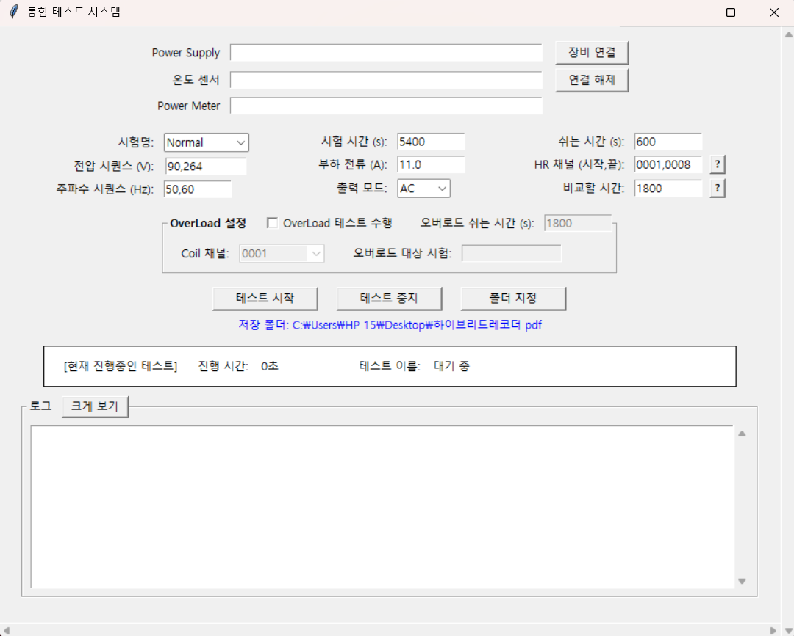
</p>
<p align="center"><sub>장비 연결, 시험 조건, 채널, 결과 폴더를 한 화면에서 설정하는 메인 UI</sub></p>

### 장비 연결 및 시험 실행

<p align="center">
  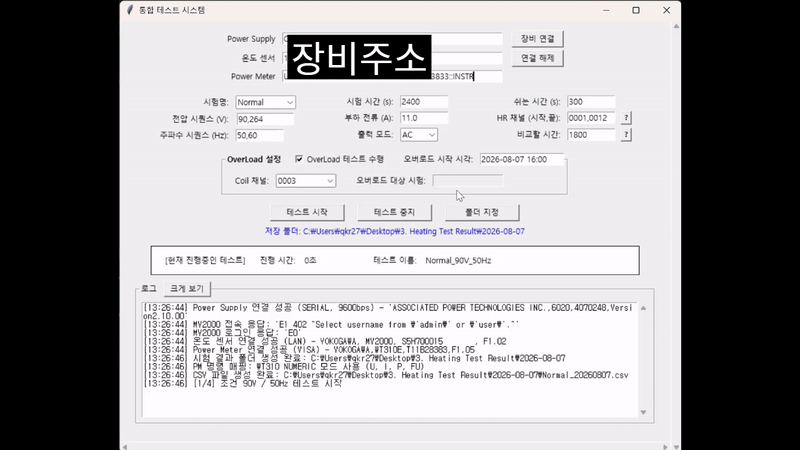
</p>

장비 주소와 시험 조건을 입력하고 연결 상태를 확인한 뒤 시험을 시작하면 측정값이 실시간으로 기록됩니다.

### Recorder 결과 수집 및 PDF 생성

<p align="center">
  
</p>

시험 종료 후 Recorder 원본을 내려받고 Universal Viewer를 제어하여 PDF 보고서를 생성·보관합니다.

## 프로젝트 배경 및 개선 과정

초기 버전은 `automation.py` 한 파일에 Tkinter GUI, VISA·Serial·LAN 통신, 장비별 명령, 온도 및 전력 측정, 포화 판정, CSV 저장이 모두 포함된 구조였습니다. GP20과 WT310을 중심으로 기본 시험을 수행할 수 있었지만, 장비별 처리와 시험 흐름이 강하게 결합되어 장비 모델을 추가하거나 일부 장비 없이 시험하기 어려웠습니다.

현재 버전은 초기 GUI의 사용 흐름을 유지하면서 장비 제어와 시험 실행을 역할별 모듈로 분리하고, 시험 종료 후 Recorder 원본 수집과 PDF 보고서 생성까지 자동화하도록 확장했습니다.

| 구분 | 초기 버전 | 현재 버전 |
|---|---|---|
| 코드 구조 | GUI와 장비 제어, 측정 로직이 단일 파일에 결합 | 역할별 모듈과 장비별 드라이버로 분리 |
| 장비 구성 | Series 6000, GP20, WT310 연결을 전제로 실행 | Recorder만 필수이며 CVCF와 Power Meter는 선택 연결 |
| 지원 장비 | Series 6000, GP20, WT310 중심 | MV2000 Recorder와 PCR Power Supply를 추가하고 기존 장비도 계속 지원 |
| 시험 실행 | 시험 조건과 포화 판정을 GUI 코드에서 직접 처리 | 시험 계획과 실행 로직을 분리하여 일관되게 처리 |
| 결과 수집 | CSV 저장 후 Recorder 원본을 수동 이동 | CSV 저장과 `.DAE`·`.GEV` FTP 다운로드 자동화 |
| PDF 보고서 | Universal Viewer에서 수동 작성 | Viewer 설정부터 PDF 출력과 보관까지 자동화 |

### 주요 개선 효과

- 장비 모델별 명령과 채널 규칙을 독립적으로 관리하여 신규 장비를 추가하기 쉬워졌습니다.
- CVCF 또는 Power Meter가 없는 구성에서도 Recorder 중심 시험을 수행할 수 있습니다.
- AC/DC 시험 조건과 측정 데이터를 명시적인 모델로 관리하여 GUI 입력과 실행 로직의 책임을 분리했습니다.
- Recorder 기록 종료 후 신규 결과파일을 자동으로 찾아 내려받으므로 USB 이동 과정이 없어졌습니다.
- 원본 파일 보존, 작업 복사본 검증, Universal Viewer 설정, PDF 출력과 바탕화면 보관이 하나의 후처리 과정으로 연결되었습니다.
- 장비 제어 실패, FTP 실패, PDF 실패를 구분하여 이미 생성된 CSV와 Recorder 원본을 최대한 보존합니다.

## 팀원 소개

- 박준석
- 조은이
- 최수아

## 주요 기능

- Recorder 중심의 시험 실행
- CVCF와 Power Meter 선택 사용
- AC/DC 시험 조건 생성 및 순차 실행
- Recorder 온도값과 Power Meter 측정값 CSV 저장
- 온도 포화 상태 판정 및 미도달 시 측정 연장
- Recorder 기록 시작·정지
- Recorder 결과파일 FTP 다운로드
- Universal Viewer 전체 PDF 워크플로 자동화
- 생성된 PDF를 바탕화면의 날짜별 보관 폴더에 복사

## 지원 장비

<table>
  <tr>
    <td align="center">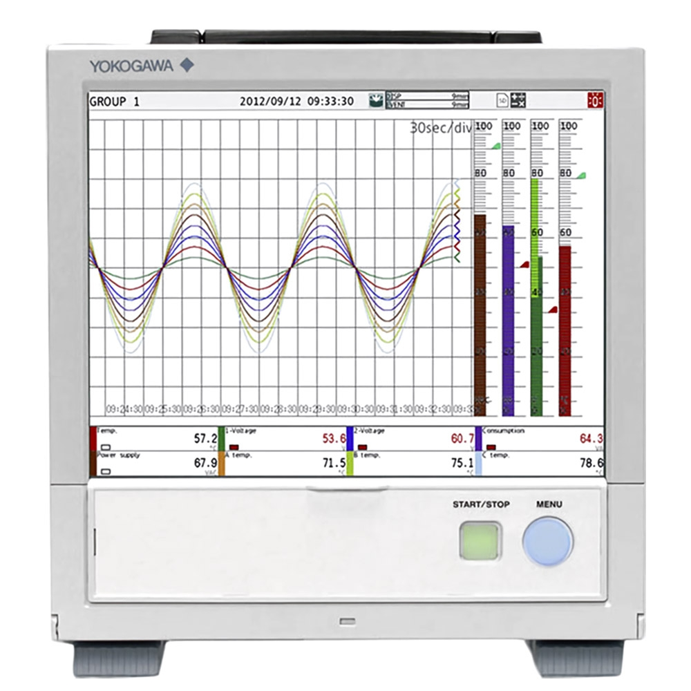<br><sub>Yokogawa GP20</sub></td>
    <td align="center">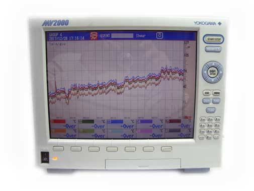<br><sub>Yokogawa MV2000</sub></td>
    <td align="center"><br><sub>Yokogawa WT310E</sub></td>
  </tr>
  <tr>
    <td align="center" colspan="2">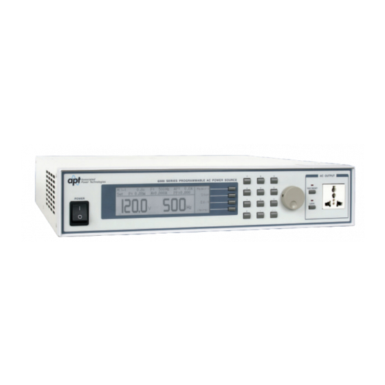<br><sub>APT Series 6000</sub></td>
    <td align="center">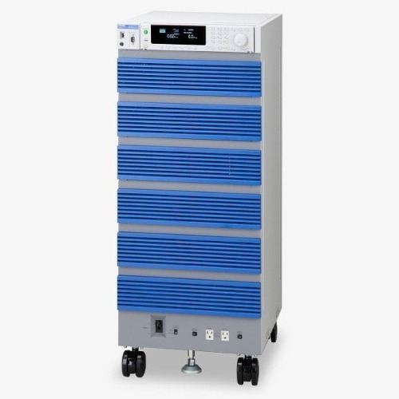<br><sub>Kikusui PCR-6000LE</sub></td>
  </tr>
</table>

### Recorder

- Yokogawa GP20
  - 결과파일: `.GEV`
  - 채널: 100번 단위 블록별 01~10 규칙
- Yokogawa MV2000
  - 결과파일: `.DAE`
  - 채널: `001~048`

### CVCF

- Series 6000
- PCR 계열

### Power Meter

- WT310

Recorder는 필수이며 CVCF와 Power Meter는 시험 구성에 따라 생략할 수 있습니다.

## 시험 처리 순서

각 시험 조건은 다음 순서로 처리됩니다.

1. CVCF가 연결된 경우 전압·주파수 조건을 설정하고 출력을 켭니다.
2. Recorder의 기존 결과파일 목록을 확인합니다.
3. Recorder 기록을 시작합니다.
4. 지정된 간격으로 온도와 전력값을 읽어 CSV에 기록합니다.
5. 포화 판정을 수행하고, 미도달 시 설정된 간격으로 재판정합니다.
6. Recorder 기록과 CVCF 출력을 정지합니다.
7. 새로 생성된 `.DAE` 또는 `.GEV` 파일을 FTP로 내려받습니다.
8. 다운로드에 성공하면 Universal Viewer PDF 워크플로를 실행합니다.
9. 다음 시험 조건이 있으면 cooldown 후 반복합니다.

PDF 변환에 실패하더라도 이미 저장된 CSV와 Recorder 원본 파일은 유지됩니다. 실패 이유는 GUI 로그에 `PDF conversion error`로 표시됩니다.

### 실행 상태 예시

| 시험 시작 | 다음 조건 전환 | 포화 미달 시 재측정 |
|---|---|---|
| 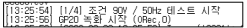 | 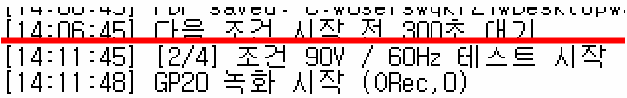 | 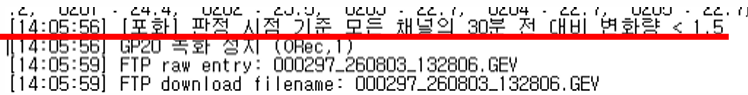 |

시험이 끝나면 결과 폴더에 측정 CSV, Recorder 원본(`.DAE` 또는 `.GEV`), PDF 보고서가 함께 저장됩니다.

<p align="center">
  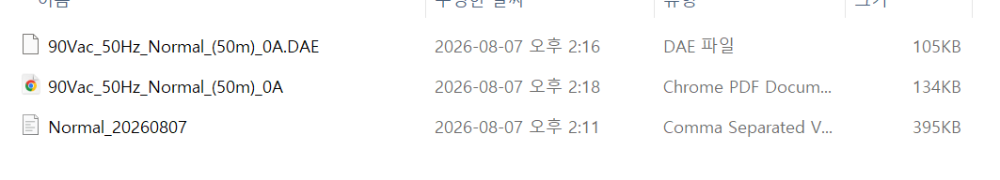
</p>

## 포화 판정

현재 기본 계획값은 `automation.py`의 `TestPlan` 생성부에서 설정합니다.

```python
cooldown_seconds=1800
saturation_check_seconds=5400
saturation_recheck_seconds=600
```

포화 상태는 모든 온도 채널의 현재값과 30분 전 값의 차이가 `1.5°C` 미만인지 확인하여 판정합니다. 포화 판정이 활성화된 시험은 GUI의 기본 시험시간에 도달하더라도 포화될 때까지 측정을 연장할 수 있습니다.

시험용으로 최초 판정 시간을 짧게 변경하더라도 `StabilizationTracker`의 기본 비교 구간은 1800초이므로, 30분 이력이 쌓이기 전에는 포화로 판정되지 않습니다.

## 오버로드 시험

오버로드 시험을 활성화하면 Coil 채널, 시작 시각, 대상 시험을 지정할 수 있습니다. 예약 시각이 되면 선택한 조건으로 시험을 시작하고 지정 채널의 온도를 로그에 표시합니다.

| 오버로드 시험 설정 | 예약 실행 로그 |
|---|---|
| 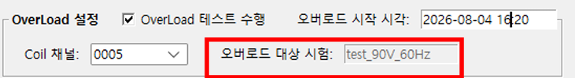 | 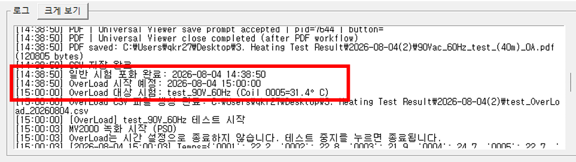 |

## Universal Viewer PDF 워크플로

다운로드된 Recorder 원본은 직접 변경하지 않습니다. 검증된 작업 복사본을 만든 뒤 다음 과정을 수행합니다.

1. `.DAE` 또는 `.GEV` 파일 검증
2. `output/work/`에 작업 복사본 생성 및 SHA-256 검증
3. Universal Viewer 실행
4. Viewer 메인 창 크기와 위치 정규화
5. `시간축 > 전부표시` 적용
6. 표시 그룹 설정 적용
7. 커서값 창 열기
8. A/B 커서 시간 차이 조정
9. 커서값 창을 인쇄 메뉴와 겹치지 않는 위치로 이동
10. `Microsoft Print to PDF`로 출력
11. 생성된 PDF 파일 크기 및 선택적 구조 검증
12. 바탕화면 날짜별 보관 폴더에 PDF 복사

현재 A/B 커서 기본 목표는 30분입니다.

```python
AB_CURSOR_ACCEPT_MIN_SECONDS = 1795
AB_CURSOR_ACCEPT_MAX_SECONDS = 1800
AB_CURSOR_TARGET_SECONDS = 1800
```

커서 좌표는 Universal Viewer 창 크기와 그래프 표시 범위를 기준으로 보정되어 있습니다. 지나치게 짧은 Recorder 데이터에서는 목표 시간 범위를 만들 수 없어 PDF 인쇄 전에 워크플로가 중단될 수 있습니다.

## PDF 저장 위치

PDF 원본은 다운로드된 `.DAE` 또는 `.GEV` 파일과 같은 결과 폴더에 생성됩니다. 같은 이름이 있으면 숫자 suffix를 붙여 기존 파일을 덮어쓰지 않습니다.

생성 및 검증이 끝난 PDF는 다음 경로에도 복사됩니다.

```text
바탕화면/
└─ 3. Heating Test Result/
   └─ YYYY-MM-DD/
      └─ 결과.pdf
```

같은 이름의 보관 파일이 있고 크기가 다르면 `_copy2`, `_copy3` 형태로 새 파일을 만듭니다. 바탕화면 복사에 실패해도 원래 생성된 PDF는 유지됩니다.

## 설치

Python 3.10 이상을 권장합니다.

```powershell
python -m venv .venv
.\.venv\Scripts\Activate.ps1
python -m pip install -r requirements.txt
```

PDF 구조와 페이지 수까지 검증하려면 선택적으로 `pypdf`를 설치합니다.

```powershell
python -m pip install pypdf
```

## 실행 전 준비

- Windows에 Universal Viewer가 설치되어 있어야 합니다.
- Windows의 `Microsoft Print to PDF` 프린터를 사용할 수 있어야 합니다.
- Recorder FTP에 접근할 수 있어야 합니다.
- UI 자동화 중에는 Universal Viewer 창과 인쇄 대화상자를 사용자가 직접 조작하지 않는 것이 좋습니다.

Universal Viewer 실행 파일은 다음 순서로 탐색합니다.

1. 명시적으로 전달된 실행 파일 경로
2. `UNIVERSAL_VIEWER_EXE` 환경 변수
3. `Program Files`와 `Program Files (x86)`
4. 시스템 `PATH`

환경 변수로 지정하는 예:

```powershell
$env:UNIVERSAL_VIEWER_EXE = "C:\Program Files\...\UnivViewer.exe"
```

## GUI 실행

```powershell
python automation.py
```

GUI에서 다음 항목을 설정합니다.

- 장비 연결 주소
- 시험명
- AC/DC 모드
- 전압과 주파수 조건
- 시험시간과 샘플링 간격
- Recorder 채널 범위
- 결과 저장 폴더

장비 연결 후 시험 시작 버튼을 누르면 별도 작업 스레드에서 시험을 실행합니다.

## 수동 PDF 워크플로

이미 존재하는 `.DAE` 또는 `.GEV` 파일로 PDF 과정만 실행하려면 `run_from_input.py`를 사용할 수 있습니다.

```powershell
python run_from_input.py
```

또는 통합된 Universal Viewer CLI를 직접 실행할 수 있습니다.

```powershell
python -m integrations.universal_viewer.main `
  ".\input\sample.DAE" `
  --run-manual-pdf-workflow `
  --output-pdf ".\output\sample.pdf"
```

## 프로젝트 구조

```text
.
├─ automation.py                 # Tkinter GUI와 장비 연결
├─ test_models.py                # 시험 조건 및 측정 데이터 모델
├─ test_runner.py                # 시험, CSV, FTP 다운로드 실행
├─ pdf_converter.py              # 다운로드 결과와 PDF 워크플로 연결
├─ run_from_input.py             # 기존 원본 파일 수동 PDF 실행기
├─ devices/
│  ├─ cvcf/                      # CVCF 드라이버
│  ├─ recorder/                  # Recorder 드라이버와 FTP
│  └─ power_meter/               # Power Meter 드라이버
├─ integrations/
│  └─ universal_viewer/          # Universal Viewer 전체 자동화
├─ tests/                        # 자동화 및 통합 테스트
└─ tools/                        # A/B 커서 좌표 보정 도구
```

## 테스트

```powershell
python -m unittest discover -s tests -p "test_*.py"
```

Universal Viewer UI 자동화 테스트는 실제 장비 PC의 화면 배율, Viewer 버전, 창 크기와 Windows 대화상자 상태에 영향을 받을 수 있습니다.

## 주의사항

- 커서 좌표를 변경할 때는 `tools/`의 보정 스크립트를 사용하고 실제 장비 PC에서 확인해야 합니다.
- 시험 중 강제 종료하면 Recorder 정지나 결과파일 다운로드가 완료되지 않을 수 있습니다.
- 포화 체크 개선 가능성
  - 30분전 데이터 : A
  - 현재 데이터 : B
  - =>   현재는 `|A-B|` 의 값을 비교하지만 이후 `A-B 사이의 최대값 - 최솟값` 비교로 개선할 가능성이 있습니다.
